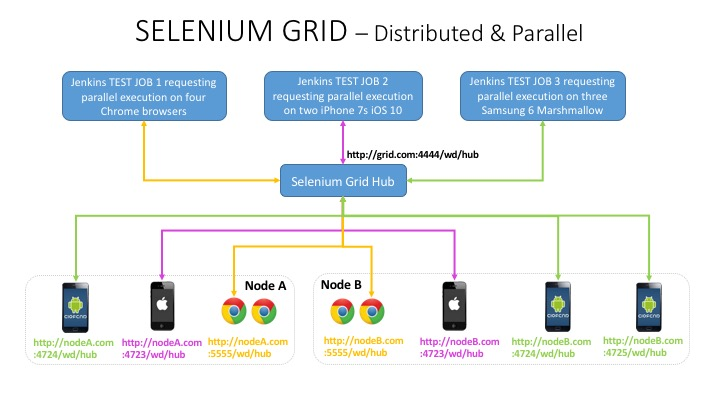

# Distributed & Parallel Test Execution with Selenium Grid

## Setting up parallel testing

In order to run parallel tests, you will need to create multiple runner classes. Each runner class points to a portion of the tests
that are partitioned either by tags or features. 

Then specify the number of threads to run in parallel. This is provided by the maxParallelForks property in build.gradle. 
The max number of maxParallelForks should be less or equal to the number of runner classes. 

## Setting up Selenium Grid

## Running parallel tests on localhost

To run the test, execute the following command that creates four threads to run the tests partitioned by the runner classes in parallel.

`gradle clean test aggregate -DmaxParallelForks=4`

## Running parallel tests with Selenium Grid

Refer to the serenity-selenium-grid-testing repo to set up selenium grid and hub.

`gradle clean test aggregate -DmaxParallelForks=2 -Dappium.hub=http://grid.com:4444/wd/hub 
-Dappium.platformName=iOS -Dappium.platformVersion=10.1 -Dappium.deviceName="iPhone 7 Plus" -Dappium.hub=http://grid.com:4444/wd/hub`

Assuming that two nodes are set up with the iPhone 7 iOS 10.1 capability, subscribed to the grid hub on http://grid.com:4444/wd/hub,
and each node has a maxSession=1, then you will be able to use the above command to create two threads. The grid will then launch
the iOS simulator on each node. 

Note that it is not possible to launch more than one iOS simulator on a mac, unless you have xCode server installed. This is not an
Appium limitation but limitation by Apple itself. It is possible to launch multiple Android emulators and browsers on a node therefore
you could run the following command.

`gradle clean test aggregate -DmaxParallelForks=4 -webdriver.remote.url=http://grid.com:4444/wd/hub -Dwebdriver.remote.driver=chrome`

Assuming that two nodes are set up with Selenium Chrome Driver, subscribed to the grid, and each node has maxSession=2, then you will
be able to use the above command to create 4 threads that the grid will then launch two Chrome browsers on each node.

